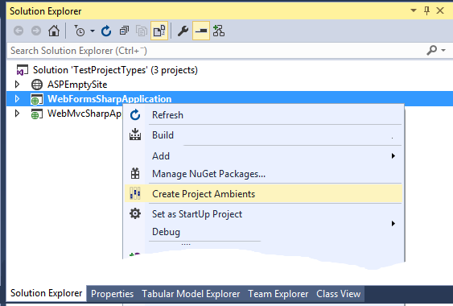
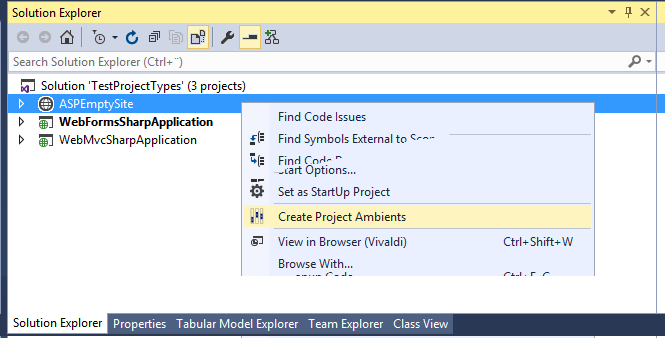
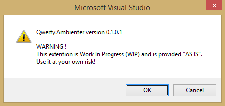
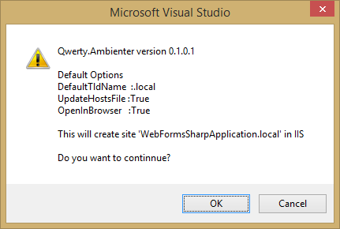
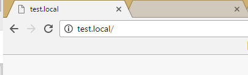
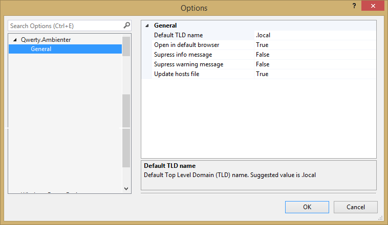

# Ambienter

Visual Studio Extention for setting up ambient environment for a project.

## Documentation

### Version 0.1.0.1

## Use

Ambienter intergrates with Visual Studio and adds two new menu items:

One in the context menu when right clicking on a WebProject

and one in the context menu when right clicking on a WebSite

If clicking on the Create Project Ambients, the following dialog will show with a warning:

_(This dialog may be turned off in options, see  [below](#options))_

When accepting this dialog by clicking OK, the following dialog will show with info on default settings:

_(Options may be set in Visual Studio's **Tools | Options** menu, see [below](#options))_

If you accept by clicking OK, Ambienter will go ahead and (depending on the options):

1. Creating a new site in IIS with path to the project and with the name of the project with the default TLD name (_.local_)
> if the project name is _test_, Ambienter will create a site with bindings to **test.local**.

2. Update **hosts** file with th project
> if the project name is _test_, Ambienter update hosts file with the line  
> 127.0.0.1  test.local

3. Open the newly created site in default browser

## Options

Setting for Ambienter is available in the Visual Studio's **Tools | Options** menu:

* Default TLD name is added to the project name

* Open in default browser: If **true**, opens the newly created site in default browser

* Suppress info message: If **true**, the Default Options Dialog is not shown (second dialog in use).

* Supress warning message:  If **true**, supresses Warning Dialog when starting the extention (first dialog in use).

* Update hosts file:  If **true**, updates the host file with the newly created site's binding.
